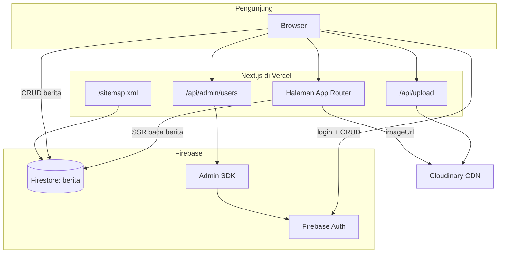

# PT. Wijaya Kencana Indonesia — Website Resmi

Website resmi **PT. Wijaya Kencana Indonesia (WKI)**, perusahaan **Perizinan Berusaha Pemanfaatan Hutan (PBPH)** untuk pemanfaatan hasil hutan kayu hutan alam di Kabupaten Halmahera Selatan, Maluku Utara.

Situs ini mencakup halaman profil perusahaan, berita dinamis dengan panel admin, upload gambar, serta optimasi SEO dan keamanan Firestore.

---

## Daftar Isi

- [Teknologi](#teknologi)
- [Fitur](#fitur)
- [Halaman & Rute](#halaman--rute)
- [Arsitektur](#arsitektur)
- [Persyaratan](#persyaratan)
- [Instalasi Lokal](#instalasi-lokal)
- [Variabel Lingkungan](#variabel-lingkungan)
- [Setup Firebase](#setup-firebase)
- [Setup Cloudinary](#setup-cloudinary)
- [Aturan Keamanan Firestore](#aturan-keamanan-firestore)
- [Panel Admin](#panel-admin)
- [Testing](#testing)
- [Deployment ke Vercel](#deployment-ke-vercel)
- [Struktur Proyek](#struktur-proyek)
- [Skema Data Berita](#skema-data-berita)
- [Pemecahan Masalah](#pemecahan-masalah)

---

## Teknologi

| Lapisan | Teknologi | Versi (approx.) |
|--------|-----------|-----------------|
| Framework | [Next.js](https://nextjs.org/) (App Router) | 15.5.x |
| UI | [React](https://react.dev/) | 18.3.x |
| Bahasa | [TypeScript](https://www.typescriptlang.org/) | 5.9.x |
| Styling | [Tailwind CSS](https://tailwindcss.com/) | 3.4.x |
| Database | [Firebase Firestore](https://firebase.google.com/docs/firestore) | — |
| Autentikasi | [Firebase Authentication](https://firebase.google.com/docs/auth) (Email/Password) | — |
| Admin server | [Firebase Admin SDK](https://firebase.google.com/docs/admin/setup) | — |
| Gambar | [Cloudinary](https://cloudinary.com/) (upload via API route) | — |
| Hosting | [Vercel](https://vercel.com/) (disarankan) | — |
| Testing | [Jest](https://jestjs.io/) + `next/jest` | — |

**Catatan:** README lama menyebut Next.js 14; proyek saat ini menggunakan **Next.js 15**.

---

## Fitur

### Publik
- Halaman beranda dengan carousel hero
- Profil perusahaan, visi & misi
- Daftar dan detail berita (server-rendered untuk SEO)
- Navigasi prev/next antar artikel
- Halaman keberlanjutan (placeholder) dan kontak
- Sitemap otomatis (`/sitemap.xml`)
- Metadata & Open Graph per halaman

### Admin (`/admin`)
- Login email/password (Firebase Auth)
- CRUD berita: judul, slug, tanggal, konten, gambar
- Upload gambar ke Cloudinary lewat API server (`/api/upload`)
- Tab **Kelola Admin**: tambah/hapus akun editor (membutuhkan Firebase Admin SDK)

### Keamanan & kualitas
- Aturan Firestore: baca publik untuk `berita`, tulis hanya jika login
- Berita di-fetch di server (ISR `revalidate: 60`) agar crawlable oleh mesin pencari
- Unit test untuk utilitas dan route upload

---

## Halaman & Rute

| Halaman | URL | Render |
|---------|-----|--------|
| Beranda | `/` | Static |
| Tentang Kami | `/tentang` | Static |
| Berita (daftar) | `/berita` | Static + revalidate 60s |
| Detail berita | `/berita/[id]` | Dynamic (SSR) |
| Keberlanjutan | `/keberlanjutan` | Static |
| Hubungi Kami | `/kontak` | Static |
| Sitemap | `/sitemap.xml` | Dynamic |
| Admin login | `/admin` | Client |
| Admin dashboard | `/admin/dashboard` | Client |
| Upload gambar (API) | `POST /api/upload` | Server |
| Kelola user admin (API) | `GET/POST/DELETE /api/admin/users` | Server |

---

## Arsitektur



### Alur simpan berita (admin)

1. Admin login di `/admin` → Firebase Auth.
2. Di dashboard, isi form berita; opsional pilih file gambar.
3. Jika ada gambar → `POST /api/upload` → Cloudinary mengembalikan `secure_url`.
4. Data (judul, konten, tanggal, slug, `imageUrl`, `createdAt`) disimpan ke koleksi Firestore `berita`.

### Alur tampil berita (publik)

1. Halaman `/berita` dan `/berita/[id]` memanggil `lib/firestore-server.ts` di **server** (Firestore REST API).
2. HTML sudah berisi konten saat pertama load → lebih baik untuk SEO daripada fetch murni di client.
3. Data di-cache ulang setiap **60 detik** (`revalidate = 60`).

---

## Persyaratan

- **Node.js** 18.17+ (disarankan 20 LTS)
- **npm** 9+
- Akun [Firebase](https://console.firebase.google.com/)
- Akun [Cloudinary](https://cloudinary.com/)
- (Opsional) [Firebase CLI](https://firebase.google.com/docs/cli) untuk deploy aturan Firestore
- (Opsional) Akun [Vercel](https://vercel.com/) untuk hosting

---

## Instalasi Lokal

```bash
git clone https://github.com/ArthaCorporation/WebsiteWKI.git
cd WebsiteWKI
npm install
```

Buat file `.env.local` di root proyek (lihat [Variabel Lingkungan](#variabel-lingkungan)).

```bash
npm run dev
```

Buka [http://localhost:3000](http://localhost:3000).

Perintah lain:

| Perintah | Kegunaan |
|----------|----------|
| `npm run dev` | Development server |
| `npm run build` | Build produksi (jalankan sebelum push/deploy) |
| `npm run start` | Jalankan build produksi secara lokal |
| `npm run lint` | ESLint |
| `npm run test` | Jest (semua test) |
| `npm run test:watch` | Jest mode watch |

---

## Variabel Lingkungan

Buat `.env.local` di root (file ini **tidak** di-commit ke Git).

### Firebase (client — wajib)

Digunakan di browser untuk Auth dan CRUD berita dari dashboard admin.

```env
NEXT_PUBLIC_FIREBASE_API_KEY=
NEXT_PUBLIC_FIREBASE_AUTH_DOMAIN=
NEXT_PUBLIC_FIREBASE_PROJECT_ID=
NEXT_PUBLIC_FIREBASE_MESSAGING_SENDER_ID=
NEXT_PUBLIC_FIREBASE_APP_ID=
```

Ambil dari: **Firebase Console → Project Settings → Your apps → SDK setup and configuration**.

### Cloudinary (server — wajib untuk upload gambar)

Upload dilakukan lewat **server-side SDK** (bukan unsigned preset di browser).

```env
NEXT_PUBLIC_CLOUDINARY_CLOUD_NAME=
CLOUDINARY_API_KEY=
CLOUDINARY_API_SECRET=
```

Ambil dari: **Cloudinary Dashboard → Settings → API Keys**.

### Firebase Admin (server — opsional, untuk Kelola Admin)

Hanya diperlukan untuk tab **Kelola Admin** (`/api/admin/users`).

```env
FIREBASE_SERVICE_ACCOUNT_KEY={"type":"service_account",...}
```

**Penting — format nilai:**

- Harus **satu baris** JSON valid (tanpa line break di `.env`).
- Jangan bungkus dengan tanda kutip tambahan di luar JSON.
- Cara aman membuat nilai satu baris (dari file JSON yang didownload):

```bash
node -e "console.log('FIREBASE_SERVICE_ACCOUNT_KEY=' + JSON.stringify(JSON.parse(require('fs').readFileSync('./your-service-account.json','utf8'))))"
```

Salin output ke `.env.local` (atau ke Vercel Environment Variables).

**Jangan commit** file service account (`*firebase-adminsdk*.json`) — sudah di-ignore di `.gitignore`.

---

## Setup Firebase

### 1. Buat proyek & web app

1. [Firebase Console](https://console.firebase.google.com/) → **Add project**
2. Tambahkan app **Web** (`</>`) → salin config ke `.env.local`

### 2. Firestore

1. **Firestore Database** → Create database
2. Buat collection: **`berita`**
3. Deploy aturan keamanan (lihat [Aturan Keamanan Firestore](#aturan-keamanan-firestore))

### 3. Authentication

1. **Authentication** → **Sign-in method** → aktifkan **Email/Password**
2. Buat user admin pertama: **Authentication → Users → Add user**

### 4. Service account (untuk multi-editor)

1. **Project Settings → Service accounts → Generate new private key**
2. Simpan file JSON secara lokal (jangan push ke Git)
3. Set `FIREBASE_SERVICE_ACCOUNT_KEY` di `.env.local` / Vercel seperti di atas

---

## Setup Cloudinary

1. Daftar di [cloudinary.com](https://cloudinary.com/)
2. Catat **Cloud name**, **API Key**, **API Secret**
3. Masukkan ke `.env.local`

Gambar berita disimpan di folder Cloudinary: **`wki_berita`** (diatur di `app/api/upload/route.ts`).

Domain `res.cloudinary.com` sudah diizinkan di `next.config.mjs` untuk `next/image`.

---

## Aturan Keamanan Firestore

File: `firestore.rules`

```
berita/{docId}  → read: semua orang | write: hanya user login
semua path lain → ditolak
```

### Deploy aturan

```bash
npm install -g firebase-tools
firebase login
firebase use website-wki-148d2   # ganti dengan project ID Anda
firebase deploy --only firestore:rules
```

Konfigurasi deploy: `firebase.json` + `firestore.indexes.json`.

**Urutan deploy yang aman:** push kode Next.js → pastikan `/berita` jalan di production → baru deploy rules (jika belum). Aturan saat ini mengizinkan **read publik** pada `berita`, jadi tidak akan memblokir halaman berita.

---

## Panel Admin

### Login

1. Buka `/admin`
2. Masukkan email/password admin Firebase

### Kelola Berita

1. `/admin/dashboard` → tab **Kelola Berita**
2. **+ Tambah Berita** → isi judul, slug (opsional), tanggal, konten, gambar
3. **Simpan** → Firestore + Cloudinary (jika ada gambar)

Slug otomatis dari judul jika dikosongkan (`lib/utils.ts` → `generateSlug`).

URL publik artikel: `/berita/{documentId}` (ID Firestore, bukan slug).

### Kelola Admin (multi-editor)

1. Tab **Kelola Admin**
2. **+ Tambah Admin** → email, password (min. 6 karakter), nama opsional
3. Hapus admin lain (tidak bisa hapus akun yang sedang login)

Membutuhkan `FIREBASE_SERVICE_ACCOUNT_KEY` di environment. Tanpa itu, tab menampilkan pesan setup.

---

## Testing

```bash
npm test
```

| File | Cakupan |
|------|---------|
| `__tests__/utils.test.ts` | `formatDate`, `generateSlug` |
| `__tests__/upload.test.ts` | `POST /api/upload` (no file, sukses, error) |

Konfigurasi: `jest.config.js`, `jest.setup.ts`.

---

## Deployment ke Vercel

### 1. Push ke GitHub

Branch production di repo ini: **`master`**.

```bash
git add .
git commit -m "pesan commit"
git push origin master
```

### 2. Hubungkan ke Vercel

1. [vercel.com](https://vercel.com) → **New Project** → import `ArthaCorporation/WebsiteWKI`
2. **Settings → Git → Production Branch** = `master`
3. **Settings → Environment Variables** — tambahkan semua variabel dari `.env.local`:

| Variable | Production |
|----------|------------|
| `NEXT_PUBLIC_FIREBASE_*` | ✅ Wajib |
| `NEXT_PUBLIC_CLOUDINARY_CLOUD_NAME` | ✅ Wajib |
| `CLOUDINARY_API_KEY` | ✅ Wajib |
| `CLOUDINARY_API_SECRET` | ✅ Wajib |
| `FIREBASE_SERVICE_ACCOUNT_KEY` | ✅ Jika pakai Kelola Admin |

4. **Deploy** / tunggu auto-deploy setelah push

### 3. Domain & sitemap

- Domain production (contoh): `https://wki-poleko.com`
- Base URL sitemap di `app/sitemap.ts` — sesuaikan `BASE_URL` jika domain berbeda

### 4. Checklist setelah deploy

- [ ] `/` — beranda tampil
- [ ] `/berita` — daftar artikel
- [ ] `/berita/[id]` — detail + judul tab browser benar
- [ ] `/sitemap.xml` — berisi halaman + artikel
- [ ] `/admin` — login berhasil
- [ ] Dashboard — tambah/edit/hapus berita
- [ ] Tab Kelola Admin — daftar user (jika `FIREBASE_SERVICE_ACCOUNT_KEY` sudah di-set)

### Deploy tidak update?

- Pastikan **Production Branch** = `master`
- **Deployments → Redeploy** (tanpa cache jika perlu)
- Commit terbaru harus muncul di log deploy

---

## Struktur Proyek

```
WebsiteWKI/
├── app/
│   ├── layout.tsx                 # Root layout, metadata default, Navbar, Footer
│   ├── page.tsx                   # Beranda
│   ├── globals.css
│   ├── sitemap.ts                 # Sitemap dinamis
│   ├── tentang/page.tsx
│   ├── keberlanjutan/page.tsx
│   ├── kontak/page.tsx
│   ├── berita/
│   │   ├── page.tsx               # Daftar berita (SSR + revalidate)
│   │   └── [id]/page.tsx          # Detail + generateMetadata
│   ├── admin/
│   │   ├── page.tsx               # Login
│   │   └── dashboard/page.tsx     # CRUD berita + kelola admin
│   └── api/
│       ├── upload/route.ts        # Upload Cloudinary
│       └── admin/users/route.ts   # List/create/delete admin users
├── components/
│   ├── Navbar.tsx
│   ├── HeroCarousel.tsx
│   └── NewsCard.tsx
├── lib/
│   ├── firebase.ts                # Client Firebase (Auth + Firestore)
│   ├── firebase-admin.ts          # Server Admin SDK
│   ├── firestore-server.ts        # Server-side read berita (REST)
│   └── utils.ts                   # formatDate, generateSlug
├── __tests__/
│   ├── utils.test.ts
│   └── upload.test.ts
├── public/images/
├── firestore.rules                # Aturan keamanan Firestore
├── firestore.indexes.json
├── firebase.json
├── next.config.mjs
├── tailwind.config.js
├── jest.config.js
└── .env.local                     # Lokal saja (gitignored)
```

---

## Skema Data Berita

Koleksi Firestore: **`berita`**

| Field | Tipe | Keterangan |
|-------|------|------------|
| `title` | string | Judul artikel |
| `content` | string | Isi penuh (plain text) |
| `date` | string | Tanggal tampilan (format `YYYY-MM-DD`) |
| `slug` | string | URL-friendly slug (disimpan, routing pakai `id`) |
| `imageUrl` | string | URL Cloudinary |
| `createdAt` | Timestamp | Untuk urutan daftar (desc) |

Document ID Firestore = URL `/berita/[id]`.

---

## Pemecahan Masalah

### Berita kosong di production tapi ada di Firebase

- Cek env `NEXT_PUBLIC_FIREBASE_PROJECT_ID` di Vercel sama dengan project Firebase yang dipakai
- Cek aturan Firestore: `allow read: if true` pada `berita`
- Buka `/berita` setelah deploy; tunggu revalidate (max ~60 detik)

### Upload gambar gagal

- Pastikan `CLOUDINARY_API_KEY` dan `CLOUDINARY_API_SECRET` di Vercel
- Cek log deploy/runtime di Vercel untuk error `/api/upload`

### Tab Kelola Admin error JSON

- `FIREBASE_SERVICE_ACCOUNT_KEY` harus **satu baris** JSON valid
- Jangan paste multi-line langsung ke `.env.local`
- Regenerate key jika pernah ter-expose

### `npm run build` gagal

- Jalankan lokal: `npm run build`
- Perbaiki error TypeScript/ESLint sebelum push

### Vercel tidak deploy commit terbaru

- Production branch = `master`
- Push ke `origin/master`
- Redeploy manual di dashboard Vercel

---

## Lisensi & Kontak

- **Repository:** [github.com/ArthaCorporation/WebsiteWKI](https://github.com/ArthaCorporation/WebsiteWKI)
- **Perusahaan:** PT. Wijaya Kencana Indonesia  
- **Alamat:** Jalan Biawan No. 2 C, Desa Sidomulyo, Kecamatan Samarinda Ilir, Kota Samarinda, Kalimantan Timur  
- **Tel:** +62 541-4116508

---

*Dokumentasi ini menggambarkan struktur proyek per Mei 2026. Jika menambah fitur baru, perbarui bagian Fitur, Struktur Proyek, dan Variabel Lingkungan.*
